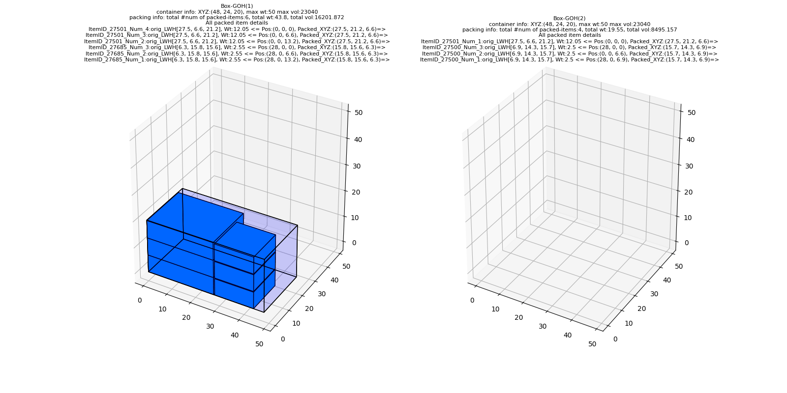
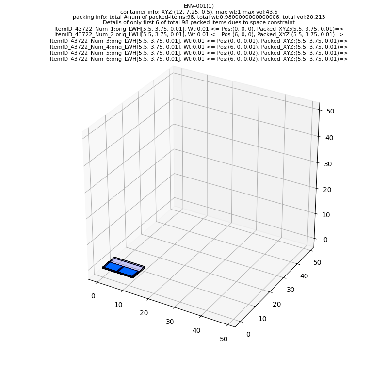
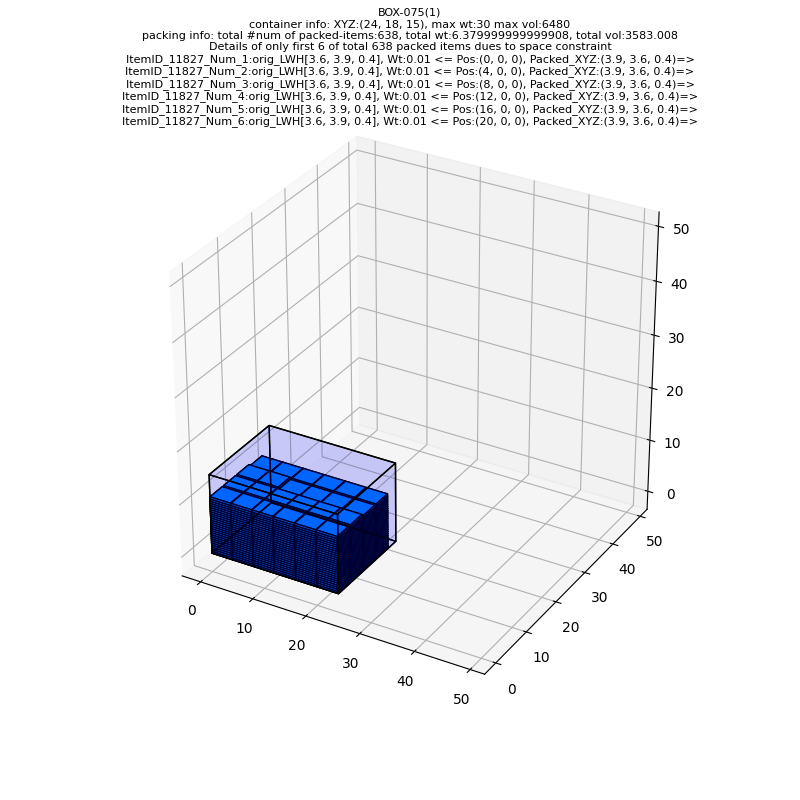

## Offline-4D-BPP-DRL (Offline, Multi-items, Multi-Bins Packing)
**Pack multiple items into minimum number of containers**

## Sections:
- [Sec A. Code Structure and overview](#code-structure)
- [Sec B. Solution overview](#solution-steps)
	- [Problem complexity](#problem-complexity)
	- [Main solution steps](#solution-steps)	
	- [Time complexity](#time-complexity)
	- [Packing performance statistics](#performance-stats)
- [Sec C. Generate predictions](#live-predictions)
- [Sec D. Prediction demo  - some single/multi-customer orders, single/multi-items cases](#prediction-demo)
	- [single customer - 3 different items, total items: 10](#demo-1)
	- [single customer - single item, total items: 98](#demo-2)
	- [single customer - single item, total items: 638](#demo-3)
	- [19 different customers - total items: 308 (processed in parallel)](#demo-4)
	- [Single Customer (OrderID 768549) - total items: 49 (optimal 6-container packing)](#demo-5)
	- [3523 different customers - total items: 5024 (processed in parallel)](#demo-6)
	- [Full OrderData - 32,740 customers - total items: 91723 (processed in parallel)](#demo-6)

- [Sec E. Dockerization to run anywhere](#docker)
- [Sec F. References - Papers & GitHub](#references)

---
# Sec A. Code Structure and overview 

**./predict.py**

	- final script to be used for prediction in production
	- can be used for - (a) a single customer order at a time or (b) batch processing to pack many orders simultaneously in parallel 
	- needs customer orders in excel sheet as of now
	- check:
		- Sec D for demo purposes
		- Sec C & E for production usage

**./pack_env/**

	main scripts for packing logic, items/containers configuration
		- box.py              : for individual item (a.k.a Box) configuration
		- container.py        : for individual container (to be used for packing) configuration
		- container_sets.py   : for tracking state of all available containers to be used at once
		- packingEnv.py       : packing using reinforcement learning model (RL)
		- packingHeuristic.py : packing using custom heuristic

**./model_arch/**

	neural network architecture & wrapper for model training
	- net.py   : neural network architecture for DRL model
	- model.py : utility for using net.py during model training/testing etc
	- kfac.py  : (optional) in case using actor-critic framework for model training

**./mcts/**        

	code for MCTS simulations:
	- node.py       : individual node for mcts expansion and rollout
	- monteCarlo.py : for full tree simulation

**./train/**
	
	- train.py: main script for DRL model formulation

**./Data/**

	- OrderData.xlsx              : contains orders of 32,740 unique customers
	- ItemMaster.xlsx             : LWH & Weight info of each item
	- ContainerMaster.xlsx        : LWH & Weight info for each container capacity
	- ContainerizationOutput.xlsx : current packing algo's solution

---
# Sec B. Solution approach and main steps 

**Problem Complexity** 

Total number of possible solutions for brute force search:

							[(# containers) x (# of allowed XYZ rotations) x (# X-axis discrete steps) x (# Y-axis discrete steps)]
		(# of items to pack)

**Main solution steps:** 

                   Z(height)
                   |
             	   |   Y(width)
            	   |  /
      		       | /
	- (FLB:(0,0,0))|/________ X (length) 
	- Items are allowed rotations along X<->Y, Y<->Z, X<->Z axis as needed

	(1) Container LWH sorting:
		- all containers are first sorted on LWH so that X-axis is largest side & Z-axis is shortest

	(2) Items LWH sorting:
		- first each item is individually sorted on LWH like containers so that their X-axis is largest side & Z-axis is shortest
		- then all items are sorted from the item with largest X-axis value to smallest X-axis value eg from largest to smallest length

	(3) XY-grid integerization:
		- placement steps in X-axis & Y-axis are in 1 inches
		- done so as to keep track of Z-axis availability in XY-plain in manageable time by discretization

	(4) Using a hybrid heuristic & RL model combination:
		- first using a fast custom heuristic and then checking a RL model to improve it based upon time constraints
		- heuristics can be fast but less optimal, RL can be slow but more optimal. But many times heuristics give best possible optimal solution eg packing in a single container very fast, so we can avoid RL in those cases
		- eg for a customer order with ~ 10 items:
			- heuristic can give a solution in ~0.01s-0.05s
			- current RL model may take upto ~10s and can be improved further both in terms of speed & performance.
	:
	- Code logic for packing given in ./predict.py's pack_customer_order()

**Time complexity:** 

	# CUSTOMER ORDERS 	 	# TOTAL ITEMS			# TOTAL TIME(s) 	~ AVG TIME/ORDER(s) 	~ AVG TIME/ITEM(s) 	REMARKS
	1 (ORDER ID 768655) 	10 (3 diff. item type)	0.02				0.02 					0.002
	1 (ORDER ID 763092)		98 (single item type)	0.55				0.55 					0.006
	7778 (ORDERS ...) 		12915 					769 				0.1 					0.06
	28,421 [valid out of 	59693 					2405 				0.09 					0.04 				[Using only 16 cores for multi-processing. Can be made more faster on 32/64 CPUs]
	total 32,740 orders]
	1 (ORDER ID 769796)		638 (single item type)	570 				570 					0.9 				[too many items in single order, AVG TIME/ITEM is fast]	

**Packing performance statistics:** 

Summary on full order data containing 32,740 unique customer orders:

		- inputfile: ./demo/input_files/OrderData.xlsx
		- out of 32,740 only 28,421 valid orders eg remaining 4,319 had some LWH or weight violation of any item
		- on whole 28,421 orders (total items - 59,693) there was 3.26%% improvement in number of total containers used:
			- total number of containers used by our method for 28,421 orders:  28,792 
			- total number of containers used by client algo for 28,421 orders: 29,765
			- stats file: ./demo/stats.xlsx
		- on 799 orders (total items - 6,720) out of 28,421 which are non-trivial for client algo & get packed in >=2 containers we get 46.66% improvement:
			- total number of containers used by our method for 799 orders: 1,143
			- total number of containers used by client algo for 799 orders: 2,143
			- stats file: ./demo/stats_nt.xlsx
		:
		- code file for stats calculation provided in ./demo/check_stats.py

---

# Sec C. Generating predictions 

This development was done a system with these config:

	- OS:Ubuntu 16.04
	- Python3.6.9
	- Python libraries - ./requirements.txt

On a system with above config: [o/w see Dockerization in Sec E to run anywhere]

	- put customer order excel file (eg lets say FILENAME.xlsx) inside ./live_predictions/input_files/FILENAME.xlsx
	- [run from command terminal ./] python predict.py --mode=live --inputfile=FILENAME.xlsx
	- packing results get saved in ./live_predictions/pack_results/FILENAME_packing.xlsx
	- (OPTIONAL) packing plot get saved for single customer order files in ./live_predictions/pack_results/FILENAME_plot.gif
	- [disable plotting with] python predict.py --mode=live --inputfile=FILENAME.xlsx --plot_packing=False

# Sec D. Prediction demo - some single/multi-customer orders, single/multi-items cases 

For demo purposes locally:

	- put customer order excel file (eg lets say FILENAME.xlsx) inside ./demo/input_files/FILENAME.xlsx
	- [run from command terminal ./] python predict.py --mode=demo --inputfile=FILENAME.xlsx
	- packing results get saved in ./demo/pack_results/FILENAME_packing.xlsx
	- (OPTIONAL) packing plot get saved for single customer order files in ./demo/pack_results/FILENAME_plot.gif

**(a) Single customer - 3 different items, total items: 10 **

python predict.py --mode=demo --inputfile=single_customer_order_10_different_items.xlsx	
	
	- inputfile: single_customer_order_10_different_items.xlsx
	ORDER_ID	ORDER_LINE_ID	ITEM_ID	ORDER_QTY   [NAMING CONVENTION]
	768655		882100			27500	3			[ItemID_27500_Num_[1...3]]
	768655		882101			27501	4			[ItemID_27501_Num_[1...4]]
	768655		882102			27685	3			[ItemID_27685_Num_[1...3]]
	- Minimum two containers are required because total weight exceeds any single container's capacity
	- Optimal solution with two containers found in 0.02s
	:
	- Packing results saved in ./demo/pack_results/single_customer_order_10_different_items_packing.xlsx
	- Containers used: ['Box-GOH(1)', 'Box-GOH(2)']
	- Container wise item-packing:
		- Box-GOH(1)<= #items:6 details =>['ItemID_27501_Num_4 Pos:(0, 0, 0) Pack_XYZ:(27.5, 21.2, 6.6)', 'ItemID_27501_Num_3 Pos:(0, 0, 6.6) Pack_XYZ:(27.5, 21.2, 6.6)', 'ItemID_27501_Num_2 Pos:(0, 0, 13.2) Pack_XYZ:(27.5, 21.2, 6.6)', 'ItemID_27685_Num_3 Pos:(28, 0, 0) Pack_XYZ:(15.8, 15.6, 6.3)', 'ItemID_27685_Num_2 Pos:(28, 0, 6.6) Pack_XYZ:(15.8, 15.6, 6.3)', 'ItemID_27685_Num_1 Pos:(28, 0, 13.2) Pack_XYZ:(15.8, 15.6, 6.3)']
		- Box-GOH(2)<= #items:6 details =>['ItemID_27501_Num_1 Pos:(0, 0, 0) Pack_XYZ:(27.5, 21.2, 6.6)', 'ItemID_27500_Num_3 Pos:(28, 0, 0) Pack_XYZ:(15.7, 14.3, 6.9)', 'ItemID_27500_Num_2 Pos:(0, 0, 6.6) Pack_XYZ:(15.7, 14.3, 6.9)', 'ItemID_27500_Num_1 Pos:(28, 0, 6.9) Pack_XYZ:(15.7, 14.3, 6.9)']

**(b) Single customer - single item, total items: 98 **

python predict.py --mode=demo --inputfile=single_customer_order_98_same_items.xlsx	
	
	- inputfile: single_customer_order_98_same_items.xlsx
	ORDER_ID	ORDER_LINE_ID	ITEM_ID	ORDER_QTY	[NAMING CONVENTION]
	763092		876289			43722	98			[ItemID_43722_Num_[1...98]]
	- Optimal solution with just 1 container found in 0.55s
	:
	- Packing results saved in ./demo/pack_results/single_customer_order_98_same_items_packing.xlsx
	- Containers used: ['ENV-001(1)']
	- Container wise item-packing - showing only first 20 items, full available in results:	
		- ENV-001(1)<= #items:98 details =>['ItemID_43722_Num_1 Pos:(0, 0, 0) Pack_XYZ:(5.5, 3.75, 0.01)', 'ItemID_43722_Num_2 Pos:(6, 0, 0) Pack_XYZ:(5.5, 3.75, 0.01)', 'ItemID_43722_Num_3 Pos:(0, 0, 0.01) Pack_XYZ:(5.5, 3.75, 0.01)', 'ItemID_43722_Num_4 Pos:(6, 0, 0.01) Pack_XYZ:(5.5, 3.75, 0.01)', 'ItemID_43722_Num_5 Pos:(0, 0, 0.02) Pack_XYZ:(5.5, 3.75, 0.01)', 'ItemID_43722_Num_6 Pos:(6, 0, 0.02) Pack_XYZ:(5.5, 3.75, 0.01)', 'ItemID_43722_Num_7 Pos:(0, 0, 0.03) Pack_XYZ:(5.5, 3.75, 0.01)', 'ItemID_43722_Num_8 Pos:(6, 0, 0.03) Pack_XYZ:(5.5, 3.75, 0.01)', 'ItemID_43722_Num_9 Pos:(0, 0, 0.04) Pack_XYZ:(5.5, 3.75, 0.01)', 'ItemID_43722_Num_10 Pos:(6, 0, 0.04) Pack_XYZ:(5.5, 3.75, 0.01)', 'ItemID_43722_Num_11 Pos:(0, 0, 0.05) Pack_XYZ:(5.5, 3.75, 0.01)', 'ItemID_43722_Num_12 Pos:(6, 0, 0.05) Pack_XYZ:(5.5, 3.75, 0.01)', 'ItemID_43722_Num_13 Pos:(0, 0, 0.06) Pack_XYZ:(5.5, 3.75, 0.01)', 'ItemID_43722_Num_14 Pos:(6, 0, 0.06) Pack_XYZ:(5.5, 3.75, 0.01)', 'ItemID_43722_Num_15 Pos:(0, 0, 0.07) Pack_XYZ:(5.5, 3.75, 0.01)', 'ItemID_43722_Num_16 Pos:(6, 0, 0.07) Pack_XYZ:(5.5, 3.75, 0.01)', 'ItemID_43722_Num_17 Pos:(0, 0, 0.08) Pack_XYZ:(5.5, 3.75, 0.01)', 'ItemID_43722_Num_18 Pos:(6, 0, 0.08) Pack_XYZ:(5.5, 3.75, 0.01)', 'ItemID_43722_Num_19 Pos:(0, 0, 0.09) Pack_XYZ:(5.5, 3.75, 0.01)', 'ItemID_43722_Num_20 Pos:(6, 0, 0.09) Pack_XYZ:(5.5, 3.75, 0.01)', 'ItemID_43722_Num_21 Pos:(0, 0, 0.1) Pack_XYZ:(5.5, 3.75, 0.01)',...]

**(c) Single customer - single item, total items: 638 **

python predict.py --mode=demo --inputfile=single_customer_order_638_same_items.xlsx	

	- inputfile: single_customer_order_638_same_items.xlsx
	ORDER_ID	ORDER_LINE_ID	ITEM_ID	ORDER_QTY	[NAMING CONVENTION]
	769796		883281			11827	638			[ItemID_11827_Num_[1...638]]
	- Optimal solution with just 1 container found in 560s
	:
	- Packing results saved in ./demo/pack_results/single_customer_order_638_same_items_packing.xlsx
	- Containers used: ['Box-075(1)']
	- Container wise item-packing - showing only first 20 items, full available in results:	
		- BOX-075(1)<= #items:638 details =>['ItemID_11827_Num_1 Pos:(0, 0, 0) Pack_XYZ:(3.9, 3.6, 0.4)', 'ItemID_11827_Num_2 Pos:(4, 0, 0) Pack_XYZ:(3.9, 3.6, 0.4)', 'ItemID_11827_Num_3 Pos:(8, 0, 0) Pack_XYZ:(3.9, 3.6, 0.4)', 'ItemID_11827_Num_4 Pos:(12, 0, 0) Pack_XYZ:(3.9, 3.6, 0.4)', 'ItemID_11827_Num_5 Pos:(16, 0, 0) Pack_XYZ:(3.9, 3.6, 0.4)', 'ItemID_11827_Num_6 Pos:(20, 0, 0) Pack_XYZ:(3.9, 3.6, 0.4)', 'ItemID_11827_Num_7 Pos:(0, 4, 0) Pack_XYZ:(3.9, 3.6, 0.4)', 'ItemID_11827_Num_8 Pos:(4, 4, 0) Pack_XYZ:(3.9, 3.6, 0.4)', 'ItemID_11827_Num_9 Pos:(8, 4, 0) Pack_XYZ:(3.9, 3.6, 0.4)', 'ItemID_11827_Num_10 Pos:(12, 4, 0) Pack_XYZ:(3.9, 3.6, 0.4)', 'ItemID_11827_Num_11 Pos:(16, 4, 0) Pack_XYZ:(3.9, 3.6, 0.4)', 'ItemID_11827_Num_12 Pos:(20, 4, 0) Pack_XYZ:(3.9, 3.6, 0.4)', 'ItemID_11827_Num_13 Pos:(0, 8, 0) Pack_XYZ:(3.9, 3.6, 0.4)', 'ItemID_11827_Num_14 Pos:(4, 8, 0) Pack_XYZ:(3.9, 3.6, 0.4)', 'ItemID_11827_Num_15 Pos:(8, 8, 0) Pack_XYZ:(3.9, 3.6, 0.4)', 'ItemID_11827_Num_16 Pos:(12, 8, 0) Pack_XYZ:(3.9, 3.6, 0.4)', 'ItemID_11827_Num_17 Pos:(16, 8, 0) Pack_XYZ:(3.9, 3.6, 0.4)', 'ItemID_11827_Num_18 Pos:(20, 8, 0) Pack_XYZ:(3.9, 3.6, 0.4)', 'ItemID_11827_Num_19 Pos:(0, 12, 0) Pack_XYZ:(3.9, 3.6, 0.4)', 'ItemID_11827_Num_20 Pos:(4, 12, 0) Pack_XYZ:(3.9, 3.6, 0.4)'...]

**(d) 19 different customers - total items: 308 (processed in parallel) **

python predict.py --mode=demo --inputfile=19_customer_orders_total_308_items.xlsx	

	- packed in ~4.75s (eg 0.27s per order)
	- 1 order with two items couldn't be packed because of LWH/Wt violation condition of item
	- Optimal solution found for all 18 remaining orders - 17 of them in optimally 1 container, 1 in two containers 
	- Total number of containers used to pack remaining 306 items = 1*17+2 = 19 containers (~16 items per container)
	- Packing results saved in ./demo/pack_results/19_customer_order_total_308_items_packing.xlsx

**(e) Single Customer (OrderID 768549) - total orders: 49 (optimal multi-container packing) **
		
python predict.py --mode=demo --inputfile=orderID_768549_single_item_49_orders.xlsx	

		ORDER_ID	ORDER_LINE_ID	ITEM_ID	ORDER_QTY
		768549		881987			27685	49
		- packed in 6 containers (9 each in first 5, remaining 4 in last) in 0.06s
		:
		- Packing results saved in: ./demo/pack_results/orderID_768549_single_item_49_orders_packing.xlsx
		- ITEM_ID[27685]: LWH [15.6, 6.3, 15.8]	, Wt: 2.55
		- Sorted_XYZ [15.8, 15.6, 6.3], Total wt = 124.95 (49*2.55)=> 
			- atleast 3 containers are anyway needed just considering weight even when taking biggest BOX-GOH, XYZ-axis occupancy shows we can't stack anymore boxes in first 5 containers anyway , so 6 looks best case scenario
			- for any other it'll need atleast 5 containers just for adjusting weight & then since none can hold more than two adjacent items on X it'll be impossible to hold them in just 5 containers so anyway we'll need atleast 6 but most probably many more, so BOX-GOH seems best bet

**(f) 3523 different customers - total items: 5024 (processed in parallel) **

python predict.py --mode=demo --inputfile=3523_customer_orders_total_5024_items.xlsx	

	- Out of total 3523 orders: 1738 invalid orders because of some LWH or Wt violation for any item in that OrderID
	- Using 16 cores for multi-processing, 1785 orders, packed in ~715s (~0.4s per order - high just because a single order 769796 of 638 items takes 575s)
	- 1785 valid orders placed in total 1802 containers: 
		- 1774 orders packed in single container - Optimal
		- 8 in two containers, 
		- 2 in three containers
		- 1 in six containers (OrderID 768459 above in (e)) - Optimal
	- So looks we are getting optimal solutions in most cases here too
	- Packing results: ./demo/pack_results/3523_customer_orders_total_5024_items_packing.xlsx

**(g) Full OrderData with 32,740 customer orders - total items: 91753 (processed in parallel) **

python predict.py --mode=demo --inputfile=OrderData.xlsx	

	- Total orders 32,740: 
		- 4,319 can't be packed due to some LWH or Weight violation, 
		- remaining 28,421 eligible orders with total 59,693 items
	- Using 16 cores for multi-processing, 28,421 orders packed in ~2405s (~0.09s per order)
	:
	- Packing results: ./demo/pack_results/OrderData_packing.xlsx	

---
# Sec E. Dockerization to run anywhere 

First Install Docker: https://docs.docker.com/get-docker/

**Main Docker steps:**

	Step 1 [Build Docker from ./Dockerfile with tag: tag_id]: 
		docker build -t [tag_id]
	Step 2 [Start Docker, give pathname of directory where to save results from packing]:  
		docker run -v [local path of live_predictions directory]:/work/live_predictions -it [tag_id]
	Step 3 [run from Docker terminal]: 
		python3.6 predict.py --mode=live --inputfile=FILENAME.xlsx
	__
	Make sure to have FILENAME.xlsx in ./live_results/input_files/ just like as in Sec C
	It will save results just like Sec C in ./live_predictions/pack_results/

**Illustration on my local system:**

	Step 1 [Build Docker with tag ID offline4dbpp]:
		docker build -t offline4dbpp .
	Step 2 [Start Docker - using my local system's live_prediction path (/home/4dbpp/live_predictions)]
		docker run -v /home/4dbpp/live_predictions:/work/live_predictions -it offline4dbpp
	Step 3 [Run predict.py to get packing for FILENAME.xlsx]
		python3.6 predict.py --mode=live --inputfile=FILENAME.xlsx

---
# Sec F. References - Papers & GitHub 
**1. Ranked Reward: Enabling Self-Play Reinforcement Learning for Combinatorial Optimization**

- used the self-play idea for single player MCTS training from here based on Algorithm 1, Page 4 (Ranked Reward)
- **execute_episode() function in ./train/train.py contain the code logic for this part**
- Paper Link: https://arxiv.org/pdf/1807.01672.pdf

*-*

**2. Online-3D-BPP-DRL: Online 3D Bin Packing with Constrained Deep Reinforcement Learning**

- contains many general utilities for DRL for bin-packing in general
- used the MCTS idea and code from here
- Paper Link: https://arxiv.org/pdf/2006.14978.pdf
- GitHub: https://github.com/alexfrom0815/Online-3D-BPP-DRL

*-*

**3. Learning Practically Feasible Policies for Online 3D Bin Packing**

- Paper Link: https://arxiv.org/pdf/2108.13680.pdf

*-*

**4. Learning Efficient Online 3D Bin Packing on Packing Configuration Trees**

- Paper Link: https://openreview.net/pdf?id=bfuGjlCwAq
- GutHub: https://github.com/alexfrom0815/Online-3D-BPP-PCT

